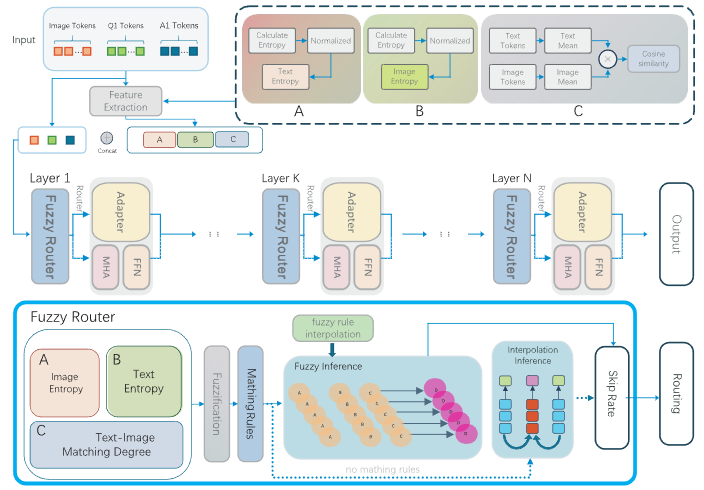

#Fuzzy Routing Expert (FuzzyRoe)

[](LICENSE)
[]()
[]()


**Abstract:** Multimodal learning has garnered increasing attention due to its ability to integrate heterogeneous data modalities such as text, image, and audio. While Mixture of Experts (MoE) architectures have emerged as a promising paradigm for enhancing computational efficiency and model scalability, conventional MoE designs suffer from two major limitations: (1) fixed skip rates that lack task adaptivity and (2) inefficient expert selection based on static prior knowledge. These constraints hinder performance in large-scale scenarios with mixed task complexities and diverse semantic patterns, such as medical image classification or heterogeneous text understanding.
To address these issues, we propose an enhanced Routing of Experts (RoE) mechanism that integrates fuzzy control theory to enable adaptive and efficient expert selection. Specifically, we design a sparse fuzzy rule base derived from prior knowledge and expert experience, which is interpolated to form a complete rule library on small datasets. This fuzzy logic-based router dynamically generates routing weights based on task complexity, effectively reducing computational cost without compromising model accuracy. Experiments validate that our Fuzzy methods yield 66.9% time and 67.2% data reductions in the Router stage, directly cutting total training time and data by 13.4%. Consistent Adapter/Finetune data with RoE preserves performance stability. Our code is included in the Supplementary Material.

<div  align="center">    

</div>

*In Proceedings of the International Conference on Learning Representations (ICLR) 2025*


## 📌 Overview
This repository contains:
- ✅ Implementation of Routing Expert
- ✅ Training/evaluation scripts

## 🚀 Getting Started

### Installation for Train
```bash
git clone https://github.com/qi-h-c/FuzzyRoe.git
cd FuzzyRoE/FuzzyRoE
conda create -n FuzzyRoE python=3.10
conda activate FuzzyRoE
pip install -r requirements.txt
```
### Preparation of Data

Please download the annotation of the final mixture our instruction tuning data from [LLaVA](https://github.com/haotian-liu/LLaVA) [llava_v1_5_mix665k.json](https://huggingface.co/datasets/liuhaotian/LLaVA-Instruct-150K/blob/main/llava_v1_5_mix665k.json), and download the images from constituting datasets:

- COCO: [train2017](http://images.cocodataset.org/zips/train2017.zip)
- GQA: [images](https://downloads.cs.stanford.edu/nlp/data/gqa/images.zip)
- OCR-VQA: [download script](https://drive.google.com/drive/folders/1_GYPY5UkUy7HIcR0zq3ZCFgeZN7BAfm_?usp=sharing), **we save all files as `.jpg`**
- TextVQA: [train_val_images](https://dl.fbaipublicfiles.com/textvqa/images/train_val_images.zip)
- VisualGenome: [part1](https://cs.stanford.edu/people/rak248/VG_100K_2/images.zip), [part2](https://cs.stanford.edu/people/rak248/VG_100K_2/images2.zip)

After downloading all of them, organize the data in your path,

```
├── coco
│   └── train2017
├── gqa
│   └── images
├── ocr_vqa
│   └── images
├── textvqa
│   └── train_images
└── vg
    ├── VG_100K
    └── VG_100K_2
```

And drop half SFT data by:

```bash
python random_drop.py
```

### Start Train

Training script with DeepSpeed ZeRO-3: 

```bash
bash scripts/v1_5/finetune_FuzzyRoE.sh
```

### Installation for Eval
```bash
cd FuzzyRoE/lmms-eval
conda create -n FuzzyRoE python=3.10
conda activate FuzzyRoE
pip install -e .
```

### Eval

Evaluate with [lmms-eval](https://github.com/EvolvingLMMs-Lab/lmms-eval):

```bash
bash eval_fuzzyroe.sh
```

## Acknowledgments

This project was made possible thanks to the following open-source projects/resources:

- **[LLaVA](https://github.com/haotian-liu/LLaVA)**  
  Our work builds upon LLaVA as the foundation for training pipeline development

- **[lmms-eval](https://github.com/EvolvingLMMs-Lab/lmms-eval)**  
  Our work applies lmms-eval's robust testing framework for model evaluation.

- **[RoE](https://github.com/DoubtedSteam/RoE.git)**
  Our work incorporates innovative modifications to RoE's core framework, including structural optimizations and functional extensions to enhance model performance.


